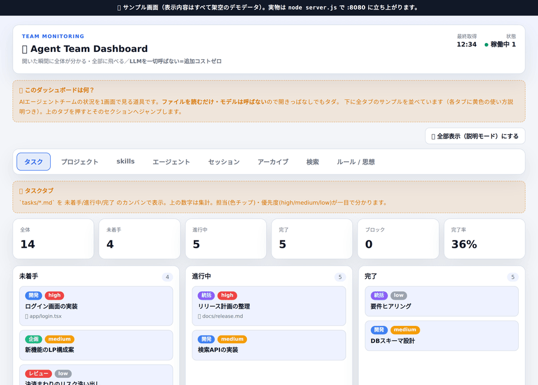

# agent-team-pack

**増えすぎて `claude --resume` から探せなくなったセッションを掘り出し、記憶を永続化し、チーム状況を一望する** —— Claude Code の運用まわりを 1 つにまとめた基盤パッケージ。

そして全部、**あなたの Claude サブスクの枠の中だけで動く**。記憶・ダッシュボード・フックといったツール群は **LLM を一切呼ばない**（ファイル読み・SQLite・grep・tmux のみ）ので、**サブスクに上乗せされる追加課金はゼロ**。



> 監視ダッシュボードのデモ（表示はすべてサンプルデータ）。`dashboard/demo.html` をブラウザで開けば単体で確認できる。

## 解決する痛み

| 痛み | このパッケージのカバー |
|---|---|
| **セッションが増えすぎて `claude --resume` から目的の会話を見つけられない** | プロジェクト横断でセッションを一覧・全文検索・稼働中/過去を判定。resume コマンドをコピーして即再開。使わないものはアーカイブして視界から外す（可逆） |
| **セッションをまたぐと文脈・決定が消える** | Markdown を真実源にした永続記憶（FTS5 全文検索・日本語対応）。セッション終了フックで自動再索引 |
| **管理ツールがバラバラで繋ぐのが面倒** | セッション/記憶/タスク/監視を 1 つのダッシュボードに統合。バラバラのツールを自分で繋ぐ必要がない |

## 価値 —— なぜこれを選ぶか

セッション管理や記憶ツールは個別には沢山ある。このパッケージの軸は **「通常のサブスク枠の中で最大限やれる、全部入り」** であること。

- **全部入り（一体型）**: 記憶・セッション発見・タスク・監視がひとそろい。単機能ツールを寄せ集めて配線する手間を肩代わりする。
- **サブスク枠の中で完結 / ツールは LLM 非依存**: 同梱ツールはどれも LLM API を叩かない。だから **ツールを常時動かしても、サブスクの外に 1 円もかからない**。従量課金や予想外の請求が構造的に発生しない。
- **記憶は Markdown が正**: SQLite/FTS5 は md から再構築できる「影」。壊れても md から作り直せる。

> **正確な範囲**: 「追加課金ゼロ」とは **同梱ツール自体が LLM を呼ばない**という意味。あなたのエージェント（Claude 本体）が動けばサブスクの利用枠は通常どおり消費される（チームを同時に回せば消費は増える）。このパッケージが消すのは「**ツールのための上乗せコスト**」であって、エージェント実行そのものを無料にするものではない。

## 前提（必要なもの）

| 用途 | 必要なもの |
|---|---|
| ダッシュボードを動かす | **Node.js 20 以上**（本体は標準ライブラリのみ・テストは `node:test`） |
| 記憶層を使う | **Python 3**（FTS5 が有効な SQLite。標準でほぼ有効） |
| プラグインとして導入する | **Claude Code CLI**（`claude`） |
| 「エージェント」タブで稼働状況を見る | **tmux**（`agents` という名のセッション。任意） |

> まず触ってみるだけなら何もインストール不要 —— `dashboard/demo.html` をブラウザで開くだけ。

## クイックスタート

目的に応じて 2 経路。**A だけでもダッシュボードは完結して使える。**

**A. ダッシュボードだけ動かす（最小・推奨の入口）**
```bash
git clone https://github.com/dbtnrobo/agent-team-pack.git
cd agent-team-pack/dashboard
cp config.example.json config.json   # <...> プレースホルダを自分の環境に置き換える（後述）
node server.js                        # http://127.0.0.1:8080
```

**B. フル導入（Claude Code プラグイン＝自動想起＋記憶スキル＋ダッシュボード監視）**
```bash
git clone https://github.com/dbtnrobo/agent-team-pack.git && cd agent-team-pack
bash install.sh "チーム名"            # 依存チェック → plugin 導入 → config.json 自動生成
```
`install.sh` が `dashboard/config.json` をあなたの環境値（HOME・記憶ディレクトリの自動検出）で
生成するので、B 経路はプレースホルダの手作業なしでそのまま動く。やめるときは `bash uninstall.sh`。

> **会社／他人の PC で使っても安全**: 環境固有の値（パス・ホスト・チーム名・起動コマンド）は
> すべて `dashboard/config.json` に隔離され、これは `.gitignore` 済みでリポジトリに入らない。
> clone される公開ツリーに自分の固有情報が混ざることはない（混入防止チェックは「公開前チェック」参照）。

## 収録物

```
agent-team-pack/
├ memory_system/   記憶層: Markdown 真実源 ＋ ローカル FTS5 検索インデックス
├ dashboard/       監視ダッシュボード: タスク/プロジェクト/セッション/検索 などを読み取り表示
└ scripts/         運用スクリプト: セッションのアーカイブ/復元 など
```

固有設定（ホスト・パス・チーム名）は `dashboard/config.json`（`.gitignore` 済み）に置く。
テンプレートは `dashboard/config.example.json`。

今後この器に **連携層(agmsg)** 等を順次追加していく。

## 導入（Claude Code プラグイン）

このリポジトリ自体が「マーケットプレイス＋プラグイン」になっている。クローンして bootstrap を実行：

```bash
git clone <this-repo> && cd agent-team-pack
bash install.sh         # 依存チェック → marketplace 登録 → plugin 導入
```

`install.sh` は `claude plugin marketplace add .` と `claude plugin install agent-team-pack@doubutuen-agent-tools` に加え、
`dashboard/config.json` の自動生成と `tasks/` の作成を行う。プラグインは以下を提供する：

- **自動想起（hooks）**: SessionStart で記憶を再索引した上で、**直近の作業文脈（CONTEXT.md の最新ブロック）と記憶の目次をセッションに自動注入**する。LLM 非依存（フックの stdout 注入を利用）。Stop で CONTEXT ローテ＋再索引。
- **記憶スキル**: `recall`（FTS5 検索で想起・記憶に無ければ transcript を grep）/ `remember`（保存。重複拒否・字数上限・絶対日付を CLI が強制）/ `memory-gc`（棚卸し。重複・陳腐化候補をツールが列挙し、統合だけセッション内で行う）。
- **monitor**（experimental）: 監視ダッシュボードを背景プロセスで起動。既に tmux 等で `:8080` を起動している場合は `claude plugin disable agent-team-pack` で競合回避。

記憶ディレクトリの指定は `/plugin configure agent-team-pack`（GUI）か環境変数で（下の一覧参照）。

### 環境変数一覧（すべて任意）

| 変数 | 既定 | 意味 |
|---|---|---|
| `MEMORY_DIRS` | userConfig → `~/.claude` | 記憶 md のディレクトリ（os.pathsep 区切り） |
| `MEMORY_CONTEXT` | 記憶ディレクトリ直下を探索 | CONTEXT.md のパス（Stop でローテ・SessionStart で注入） |
| `MEMORY_KEEP_N` | `5` | ローテで残す先頭ブロック数 |
| `MEMORY_INDEX_DB` | `CLAUDE_PLUGIN_DATA` 配下 | 索引 DB の場所（md から再構築可能な影） |
| `MEMORY_INJECT` | `1` | `0` で自動注入を停止（再索引のみ） |
| `MEMORY_INJECT_MAX_CHARS` | `4000` | 自動注入の上限字数（記憶が増えても注入量は一定） |
| `MEMORY_INJECT_BLOCKS` | `1` | CONTEXT.md から注入する先頭ブロック数 |
| `MEMORY_FILE_MAX_CHARS` | `10000` | 記憶 md 1ファイルの上限。超過時は保存を拒否し統合を強制 |
| `DASHBOARD_CONFIG` | `dashboard/config.json` | ダッシュボード設定ファイルの場所 |

## 公開前チェック

固有情報の混入を防ぐガードを同梱。公開・スクショ・配布の前に必ず実行：

```bash
bash scripts/check_no_secrets.sh   # git追跡ファイルに APIキー/固有名 等が無いか検査
```

---

## 記憶層 (memory_system/)

CLI エージェントに永続記憶を与える軽量ライブラリ。**LLM を一切呼ばない**。

- **真実の源は Markdown**。SQLite + FTS5 は md から再構築可能な検索インデックス（影）。
- **日本語対応**: FTS5 trigram トークナイザ ＋ 2文字以下は LIKE フォールバック。
- **差分再索引**: SHA-256 ハッシュで変更チャンクだけ更新、消えた節・消えたファイルは索引からも削除。
- **CONTEXT.md ローテーション**: 先頭（新しい）N ブロックを残し、古いブロックをアーカイブへ退避（肥大防止）。
- **検索結果に日付つき**: 見出しの日付（無ければ mtime）を返し、記憶の新旧を判断できる。
- 依存は Python 標準 `sqlite3` のみ（FTS5 が有効な SQLite が必要）。macOS / Linux 対応。

```bash
export MEMORY_DIRS="$HOME/.claude/memory:/path/to/workspace/memory"

python3 memory_system/index_memory.py reindex          # md を索引（差分のみ）
python3 memory_system/index_memory.py search "クエリ"    # 記憶を想起（日本語OK）
python3 memory_system/index_memory.py search "クエリ" --json   # JSON出力（date フィールド付き）
python3 memory_system/rotate_context.py path/to/CONTEXT.md -n 5 # 先頭5ブロックを残す

# 保存（remember スキルの書き込み経路。重複拒否・上限・絶対日付を強制）
python3 memory_system/memory_write.py append --file mem.md --heading "2026-06-11 決定: X" --body "..."
python3 memory_system/memory_write.py replace --file mem.md --match "決定: X" --heading "..." --body "..."

# 棚卸し（90日以上未更新・重複候補・肥大ファイルを列挙。read-only）
python3 memory_system/memory_report.py --stale-days 90
```

### 記憶が増えても「ばかにならない」ための設計

| 経路 | 対策 |
|---|---|
| 注入過多 | 自動注入は**目次方式**（ヘッダ＋CONTEXT最新ブロック＋ファイル名一覧、上限4000字）。記憶の総量と注入量が比例しない |
| 保存過多 | remember は**保存前検索→既存があれば追記でなく更新**。完全重複は CLI が自動拒否。1ファイル上限超過時は統合を強制（error-driven consolidation） |
| 経年劣化 | 検索結果の日付で新旧を判断。`memory-gc` スキル＋棚卸しレポートで重複・陳腐化を定期整理 |

候補列挙・検索・保存はすべてローカルツール（課金ゼロ）。要約・統合などの LLM 作業はセッション内＝サブスク枠で行う。

## 監視ダッシュボード (dashboard/)

ブラウザでチーム状況を一望する read-only サーバー（Node 標準のみ・`GET`/`HEAD` 限定・**LLM 非依存**）。

- タブ: タスク / プロジェクト / skills / エージェント / **セッション** / **アーカイブ** / **検索** / ルール思想。
- **セッション**: resume 可能な会話を新しい順に一覧（resume コマンドをコピー可）。稼働中/過去を判定。
- **アーカイブ**: 退避したセッションを表示（復元コマンドをコピー可）。
- **検索**: 記憶（FTS5）/ セッション / 生ログ を横断検索。セッション検索は本物のセッションだけに絞り、active/archive に応じて resume/復元コマンドを出す。
- 主な API（すべて read-only）: `/api/tasks` `/api/projects` `/api/skills` `/api/agents` `/api/sessions` `/api/archive` `/api/memory-search` `/api/session-search` `/api/log-search`。

セットアップ:

```bash
cd dashboard
cp config.example.json config.json   # <...> の値を自分の環境に置き換える
node server.js                        # 既定 :8080（config.json の serverOnly で host/allowedHosts を制御）
```

`config.json` で置き換えるプレースホルダ:

| プレースホルダ | 意味 | 例 |
|---|---|---|
| `<YOUR TEAM NAME>` | 画面に出すチーム名 | `My Team` |
| `<ABS_PATH>` | エージェントの workspace 等の絶対パス | `~/agents` を展開した絶対パス |
| `<HOME>` | ホームディレクトリ | `echo $HOME` の値 |
| `<ENCODED_LEAD_CWD>` | `~/.claude/projects/` 配下の、リードエージェントの cwd を符号化したフォルダ名 | `ls ~/.claude/projects/` で確認 |
| `<TAILSCALE_IP>` / `<TAILSCALE_HOSTNAME>` | 別端末から見る場合のアクセス元（不要なら削除可） | `100.x.y.z` |

> **手元のブラウザだけで見るなら** `serverOnly.host` は `127.0.0.1`、`allowedHosts` は `["127.0.0.1","localhost"]` のままでよい。
> **別の PC やスマホから見るなら**（例: Tailscale 経由）`host` を `0.0.0.0` にし、`allowedHosts` にアクセスに使うホスト名／IP を**必ず追加**する（未追加だと 403 で弾く安全側の挙動）。`serverOnly.dataSources` を設定しない API は空配列を返すだけで、最小構成でもダッシュボードは起動する。

### 触って試す（デモ）

サーバーを立てなくても、`dashboard/demo.html` をブラウザで開けば **サンプルデータ入り・各タブに使い方解説つき** の画面で全体像を確認できます（単体で動く自己完結 HTML。サーバー起動後は `http://<host>:8080/demo.html` でも閲覧可）。

### 使い方（タブ別）

| タブ | 何をする | 使い方 |
|---|---|---|
| **タスク** | `shared/tasks/*.md` を 未着手/進行中/完了 のカンバンで表示 | 担当(色チップ)・優先度・集計が一目で分かる |
| **プロジェクト** | `project_*.md` の進行中プロジェクト一覧 | 各カードの「🔍 関連セッションを探す」で、そのプロジェクトの過去セッションを検索タブに一発表示 |
| **skills** | 使える skill 一覧（`SKILL.md` の説明） | 何が呼べるかを一望 |
| **エージェント** | 誰が tmux 上で稼働中か | 稼働中/待機を確認 |
| **セッション** | resume できる会話を新しい順に表示（先頭に総数） | 「コピー」で resume コマンドを取得→貼れば続きから開く。稼働中/過去を判定 |
| **アーカイブ** | 退避済みセッション一覧 | 「復元コマンドをコピー」→実行で active に戻る。古いものは検索から掘る |
| **検索** | 記憶 / セッション / 生ログ を横断検索（LLM 非依存＝コストゼロ） | セッション検索は本物のセッションだけに絞り、active なら resume・archive なら復元コマンドを出す |
| **ルール / 思想** | 会社ルール・思想ドキュメントへの入口 | クリックで本文表示 |

> 操作系（タスク振り・起動ボタン等）は「キューに書くだけ」で LLM を呼ばない設計。read-only を守ることで常時表示しても追加コストはかからない。

## 運用スクリプト (scripts/)

```bash
# 稼働中以外のセッションをアーカイブへ退避（pid 生存セッションは自動除外）
bash scripts/manage_sessions.sh archive-all
# 退避したセッションを active に戻す
bash scripts/manage_sessions.sh restore <sessionId>
```

実体（`~/.claude/projects/<...>/<id>.jsonl`）を `~/.claude/projects-archive/` へ移動するだけ。中身は不変で完全に可逆。

## テスト

```bash
# 記憶層（Python・pytest）
python3 -m pytest memory_system/tests/ -q

# ダッシュボード（Node 標準の node:test・追加依存なし）
cd dashboard && npm test
```

ダッシュボードは `dashboard/lib/` の各モジュール（純粋関数・データソース読み取り・セッション操作・API ルーティング）を単体テストし、サーバーを実起動して全 API を叩く統合テスト（アーカイブ往復・method/host ガード含む）まで備える。`node:test` 組み込みのみで外部依存ゼロ。

## ライセンス / 流用元

本体は **MIT**（Copyright (c) 2026 合同会社どうぶつえん）。`LICENSE` 参照。

組み込んでいる MIT ライセンスのコード（`THIRD_PARTY_LICENSES/` に全文）：

| ファイル | 流用元 | 内容 |
|---|---|---|
| `memory_system/vendored_chunker.py` | [zilliztech/memsearch](https://github.com/zilliztech/memsearch) (MIT) | md チャンク分割（無改変コピー） |
| `memory_system/fts_index.py` | [NousResearch/hermes-agent](https://github.com/NousResearch/hermes-agent) の `hermes_state.py` (MIT) | FTS5 スキーマ（unicode61＋CJK trigram）と CJK 検索ルーティングを改変流用 |
